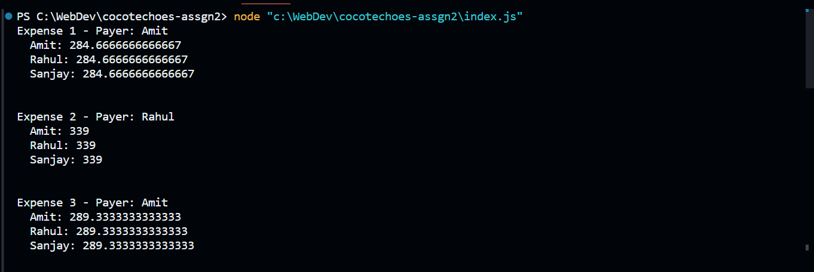
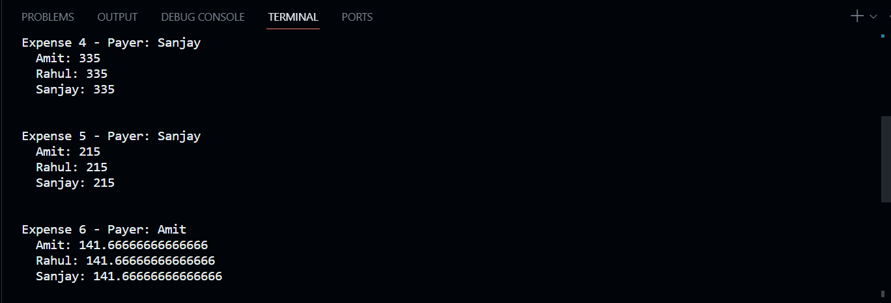
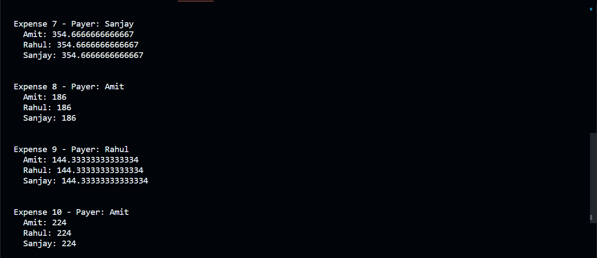

Question 2

Problem:- expense split problem 

Detailed problem explanation:- Split the expenses amongst multiple people - each expense will have one payer, and each expense will be equally shared amongst all parties. Different expenses can have different
numbers of parties. For example “Tea and Snacks Expense” shared among parties Amit, Rahul, and Sanjay. Please note you need to create a list of say 10 expenses with the title “Expense 1”,  Expense 2” etc. And randomly select one of the parties as a payer

Hint: Use a map within a map. 

 

